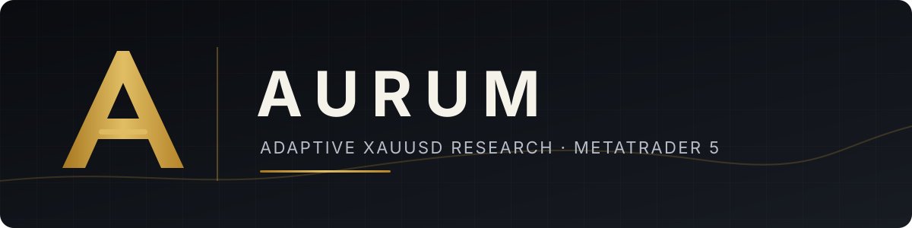
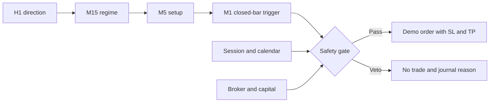

<p align="center">
  
</p>

<p align="center">
  
  
  
</p>

<p align="center">
  <a href="#overview">Overview</a> ·
  <a href="#decision-flow">Decision flow</a> ·
  <a href="#research-snapshot">Research</a> ·
  <a href="#mt5-setup">MT5 setup</a> ·
  <a href="#repository-map">Repository</a> ·
  <a href="CONTRIBUTING.md">Contributing</a>
</p>

## Overview

AURUM is an adaptive XAUUSD Cent research EA for MetaTrader 5. H1 supplies
direction, M15 classifies the regime, M5 confirms the setup, and M1 handles the
closed-bar entry. Session, calendar, broker, and capital checks can veto a trade
at any point.

This repository is a demo-validation build. Real-account support is disabled at
compile time. It is not a signal service, a profit guarantee, or a live release.

| Property | Current profile |
| --- | --- |
| Instrument | HFM Gold Cent (`XAUUSDc`) |
| Entry timeframe | M1, closed bars only |
| Context | H1 direction · M15 regime · M5 setup |
| Risk target | 0.10% of equity |
| Frequency limit | One new position per broker day |
| Default sessions | London BUY · New York SELL · Asia disabled |
| Real-account support | Disabled |

> **Capital constraint:** at 525 USC, the observed Gold setups do not satisfy
> HFM's 0.01-lot minimum at the 0.10% risk target. The expected action is
> `VOLUME_BELOW_MIN`, not a forced minimum-volume trade.

## Decision flow



Safety checks always take priority over the adaptive score. The strategy does
not use martingale, grid, averaging, recovery sizing, or minimum-lot overrides.

## Research snapshot

| Dataset | Trades | Profit factor | Net result | Main limitation |
| --- | ---: | ---: | ---: | --- |
| MetaQuotes generated ticks, 2022–2025 | 88 | 1.385 | +150.97 USD | Stand-in account and generated ticks |
| MetaQuotes real ticks, 2021–2025 | 108 | 1.202 | +104.31 USD | Extra 1.00 cost per trade removes the profit |
| HFM real ticks, available 2026 cache | 7 | 1.826 | +0.19% | Sample is too small |
| HFM generated ticks, 2023–2025 | 10 | 1.262 | +0.11 USD | Negative in 2023 and 2024 |

The record is regime-dependent and fails the current live-readiness gates.
Detailed methodology, yearly results, and rejected variants are documented in
[Research](docs/research.md), [Validation](docs/validation.md), and
[Capital feasibility](docs/capital.md).

## MT5 setup

1. Copy `src/AurumCent.ex5` to `MQL5/Experts/AurumCent/`.
2. Copy `src/HfmPreflight.ex5` to `MQL5/Scripts/`.
3. Open an HFM Cent **demo** account and make `XAUUSDc` visible in Market Watch.
4. Run `HfmPreflight` once and review every `AURUM_PREFLIGHT|...` result.
5. Attach `AurumCent` to an `XAUUSDc` M1 chart and load
   `profiles/AurumCent.set`.

Read the [preflight guide](docs/preflight.md) before testing. Tester profiles
for reproducible HFM and MetaQuotes runs are available under `profiles/`.

## Validation

```sh
./scripts/audit-ea.sh
./scripts/audit-preflight.sh
shasum -a 256 -c checksums/ea.sha256
shasum -a 256 -c checksums/preflight.sha256
python3 -m unittest -v tests/test_telegram_relay.py
```

Compilation, tester completion, forward-demo performance, and live readiness
are separate gates. A passing command above does not establish profitability.

## Repository map

| Path | Contents |
| --- | --- |
| `src/` | EA, read-only preflight probe, and compiled builds |
| `profiles/` | Default, HFM, and MetaQuotes tester profiles |
| `docs/` | Strategy, research, setup, and validation notes |
| `evidence/` | Build logs and machine-readable test records |
| `scripts/` | Static audits, Telegram relay, and research utilities |
| `checksums/` | Source and binary integrity manifests |
| `tests/` | Relay regression test and fixture |

## Notifications

The EA writes selected events to the MetaTrader Common Files outbox. An external
relay sends them to Telegram, keeping network calls and credentials outside the
trading path. See the [notification guide](docs/telegram.md).

## License

Released under the [MIT License](LICENSE). Trading and investment risk remain
the responsibility of the operator; the software is provided without warranty.
